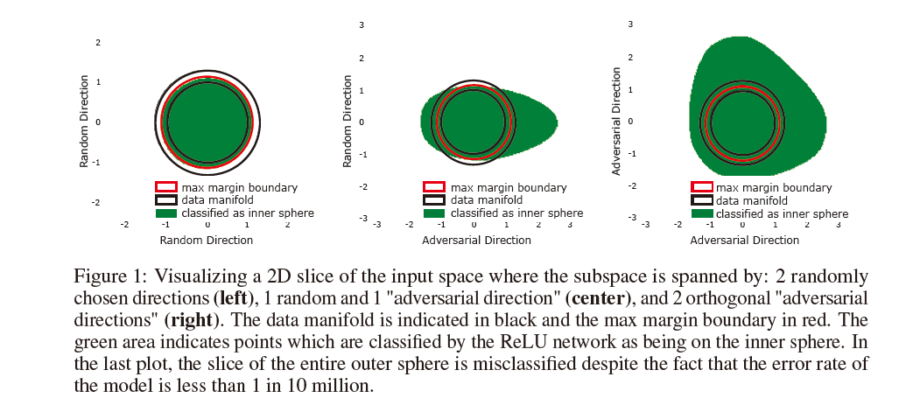
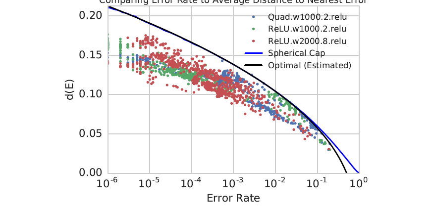

# Adversarial spheres

## Contributions

> 1.Several models trained on this dataset are vulnerable to adversarial examples, _**that is most randomly chosen points from the data distribution are correctly classified and yet are "close" to an incorrectly classified input.**_ ~~~~This behavior occurs even when the test error rate is less than 1 in 10 million and even when we restrict the adversarial search space to the data manifold.
>
> 2.For this dataset, we prove a fundamental upper bound on  $$d(E)$$ in terms of $$\mu(E)$$. In particular, we prove that any model which misclassifies a small constant fraction of the data manifold will be vulnerable to adversarial perturbations of size $$O(1/\sqrt{(n)})$$ .
>
> 3.Neural networks trained on this dataset approach this theoretical optimal bound. This implies that in order to _**linearly increase**_ $$d(E)$$, the classification error rate $$\mu(E)$$  must _**decrease**_ significantly.

## Related Work

A simple framework：datasets is ideal sphere data points, network is simple yet.  And then, due to linear activate units maybe isn't suitable, there is a new called ‘the quadratic network‘ , where  $$\sigma(x)=x^2$$ ,$$\hat{y}=\sum(\alpha_{i}z_{i}^2-1)$$                                         


In paper, they claim that a complex model is simliar with a simple model. whereas, in terms of model, maybe it is not necessary to build a deep model at least for adversarial example.


_**An image to explain manifold distribution**_

**At section 4.1, there is a function estimating of the error rate.**                            $$P_{\hat{x}\sim{S_{0}}}(\sum{\alpha_{i}x_{i}^2}>1)\approx1-\Phi(\frac{\mu}{\sigma})$$ ,where $$\mu=\sum{\alpha_{i}}-1$$,and $$\sigma=\sum(\alpha_{i}-1)^2$$ .                                        **the more importantly, a essential theorem is proved at section 5.**


_**Theorem 5.1**_  Consider any model trained on the sphere dataset. Let $$p\in[0.5,1.0]$$ denote the accuracy of the model on the inner sphere, and let E denote the points on the inner sphere the model misclassifies \(so in measure $$\mu(E)=1-p $$ \). Then $$d(E)\le O(\Phi^{-1}(p)/\sqrt{n})$$ where $$\Phi^{-1}(x)$$ is the inverse normal cdf function.


To illustrate the result of theorem5.1, there is a figure to visualize that the dimension of the inner sphere increases. Through the figure, we can get the relationship between $$d(E)$$ and $$n$$ when fixing the $$\mu(E) = 0.01$$ .

Next, the next figure shows the upper bound in theorem5.1 exists, we can conclude that the decision boundaries of these networks are all well behaved given the amount of test error observed. Also, this can prove that the similarity of difference among models.

## Reference

Personally speaking ,i think it is innovative and counterintuitive. Maybe i could regard it as a pioneering work

