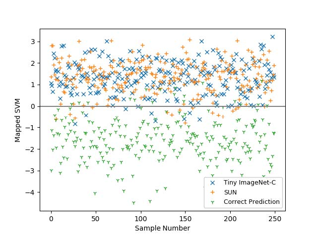
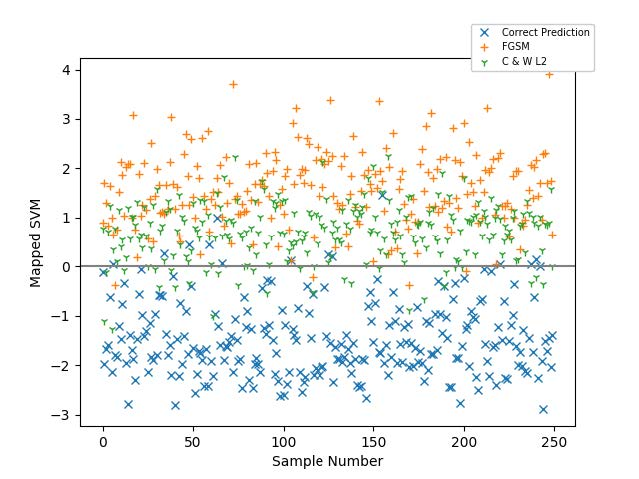

# Utilizing Network Properties to Detect Erroneous Inputs

## Contributions

> This is the first research showing that various erroneous inputs, which neural network models will fail to correctly classify, can be identified using the model’s activations in response to the input.
>
> We show that several common adversarial perturba tions tend to have softmax probabilities distinct from correct examples.
>
> We achieve state-of-the-art results by considering the activations of both the softmax and final hidden layer of common pre-trained neural networks.


Contributions\[i\] is written as Ci


## Two accountable images

## Relate Work

_**1.firstly , come up with four subfields that compose erroneous inputs**_

* Adversarial Attacks
* Image Corruption
* Out-of-Distribution Detection \(OoD\)
* Misclassified Examples and Thresholding

_**2.secondly,  discuss a series of datasets and how to get a new dataset consisting of clean data and some other data in previous four subfields**_

_**3.Thirdly,  design detection model.**_


_**How to design?  I find that authers choose outputs of hidden layers and outputs of sofmax layers,feed them into SVM , then make AUROC and AUPR as rules , check the inputs belong to which one\(clean or any other\). At last, Comparing with MSP  as results**_



_**However, I can't find the structure of detection model, whereas, I guess that authers could divide two models that the inputs of one are feeded with hidden layers outputs and the others are softmax outputs. Finally, Combine two models**_


_**4. Finally, Combined Dataset**_

## Discuss

> Our detection technique is vulnerable when presented with heavily imbalanced data given that our method requires erroneous detection models to be built for individual models, from activation data from those models, dataset imbalance is trivial to address in the data collection process. 
>
> We limit our erroneous detection models to linear SVMs, which are incapable of more complicated classifications. Predictably, these models fail when testing for multiple erroneous inputs

## Reference

1. Gilmer, J., Metz, L., Faghri, F., Schoenholz, S. S., Raghu, M., Wattenberg, M., and Goodfellow, I. Adversarial spheres. arXiv:1801.02774 \[cs\], 2018.
2. Hendrycks, D. and Dietterich, T. Benchmarking neural network robustness to common corruptions and perturbations. arXiv:1903.12261 \[cs, stat\], 2019.

